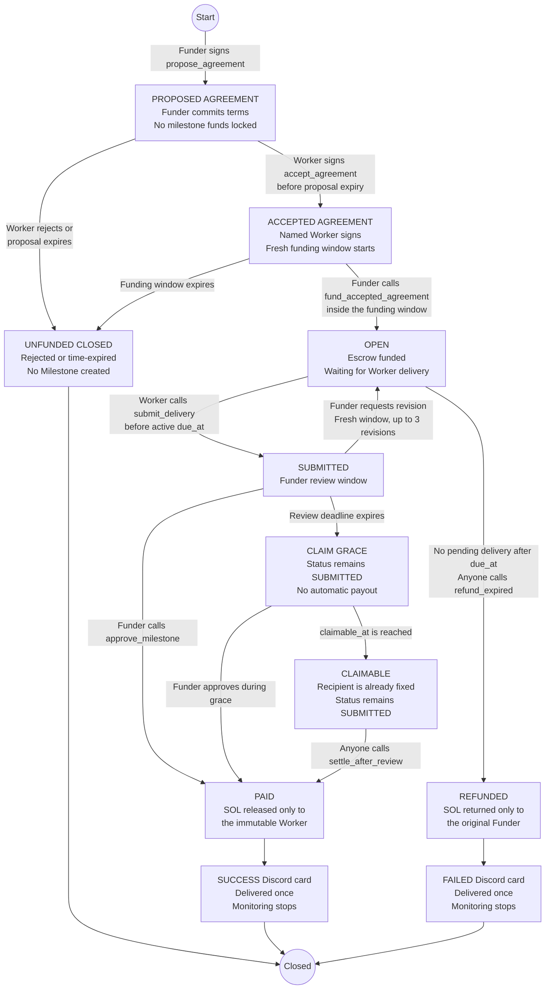

# PrazoPay

**Deadline-native milestone escrow with proactive ZeroClaw operations.**

[](https://github.com/zxc982/prazopay-zeroclaw/actions/workflows/ci.yml)

PrazoPay turns a freelance milestone into an immutable Solana state machine.
In the deployed **protocol v2**, the Funder first proposes the parties,
amount, terms commitment, delivery window, review/revision window, independent
post-acceptance funding window, and silence policy
without locking funds. The named Worker must sign the same on-chain Agreement
before the Funder can fund it. Funding then creates the Milestone and starts
the complete delivery window.

After delivery, only the Funder may approve or request revision during review.
If the explicitly accepted review window and claim grace both expire, any
permissionless trigger may release the exact amount only to the immutable
Worker. If delivery is missed, anyone may return the exact amount only to the
original Funder.

> Lock the money. Lock the deadline. Remove the ghosting.

## Why v2 exists

| | Legacy v1 | Current v2 |
| --- | --- | --- |
| Before escrow | Funder creates a Milestone directly | Funder proposes an Agreement without locking SOL |
| Worker consent | No separate pre-funding acceptance state | The exact named Worker must sign the committed terms |
| Funding clock | Starts with Milestone creation | Starts only after Worker acceptance, inside a fresh funding window |
| Role today | Backward-compatibility fixture and historical evidence | Deployed Agreement-first protocol and primary submission |

The retained v1 fixture proves that the compatible upgrade still decodes and
executes historical accounts. It is not an alternate current workflow.

## Protocol lifecycle



The Agreement commits the parties, amount, terms hash, windows, and explicit
silence policy, but it never holds the milestone amount. Only a Worker-accepted
Agreement can be funded; that atomic funding transaction creates the Milestone,
locks the exact SOL amount, and starts the complete delivery window.

ZeroClaw observes every stage through finalized, read-only Solana RPC calls and
reports only the responsible role and currently permitted action. It never
receives a wallet key or signing authority. Delay alerts occur at the first
delay, 30 minutes, 2 hours, and then once per day. After one acknowledged
terminal notification, monitoring stops.

## Why this is not another payment bot

The current ZeroClaw bounty field already contains Solana Pay invoice
generators, receipt monitors, unsigned transfers, and x402 micro-spending.
PrazoPay addresses a different failure mode: **post-delivery payment delay**.
Its differentiator is an on-chain deadline and review protocol, not another way
for an agent to hold or send money.

ZeroClaw is a coordinator, never a custodian:

- the Anchor program is the settlement authority;
- human wallets sign funding, delivery, and review actions;
- permissionless triggers may finalize an expired refund or acknowledged
  silence settlement, but can never choose the recipient;
- the ZeroClaw WASM tool is read-only and returns state plus possible next
  actions;
- a separate read-only Agreement tool assigns Worker acceptance/rejection and
  Funder funding actions before escrow exists;
- a native ZeroClaw journey heartbeat follows the Agreement into its recorded
  Milestone automatically and pushes role-specific Discord alerts when
  acceptance, funding, review, settlement, or refund becomes actionable;
- a loopback delivery relay persists successful event IDs, suppresses duplicate
  heartbeat output across restarts, and closes monitoring only after the single
  terminal Discord card is accepted;
- the model cannot change the funder, worker, amount, terms hash, deadline, or
  review window (the active delivery deadline advances only through the
  program's deterministic revision rule); and
- no wallet key, seed phrase, or signing endpoint is exposed to ZeroClaw.

## Install the native ZeroClaw Skill

PrazoPay ships a native [`SKILL.md`](skills/prazopay/SKILL.md) named
`prazopay`. It constrains the agent to finalized devnet facts, the two read-only
WASM tools, shortened public addresses in Discord prose, and human-signed or
permissionless protocol actions that cannot select a recipient.

Audit and install it with ZeroClaw:

```bash
zeroclaw skills audit ./skills/prazopay
zeroclaw skills install ./skills/prazopay
zeroclaw skills list
```

The active Creator configuration selects the same bundle name:

```bash
./scripts/zeroclaw-prazopay-skill.sh enable \
  "$HOME/.config/zeroclaw-entrega/creator"
```

## Reproduce from a clean checkout

No wallet, Discord bot, model API key, or Solana deployment keypair is required.
On Windows with WSL:

```powershell
git clone https://github.com/zxc982/prazopay-zeroclaw.git
Set-Location .\prazopay-zeroclaw
.\scripts\reproduce.ps1
```

On Linux or inside WSL:

```bash
git clone https://github.com/zxc982/prazopay-zeroclaw.git
cd prazopay-zeroclaw
bash ./scripts/reproduce.sh
```

The final line is `REPRODUCE=PASS`. The command checks formatting, all Rust
workspace tests, a fresh v2 SBF build, the complete Worker-acceptance lifecycle
against that SBF in LiteSVM, the WASI Preview 2 status component, mandatory
component validation, path-independent byte-exact WASM comparison, Bash syntax,
relay tests, native ZeroClaw Skill layout, and historical v1 fixture
consistency.

See [`docs/REPRODUCE.md`](docs/REPRODUCE.md) for prerequisites, expected output,
the verification map, and independent public-chain checks.

To compare the current v2 repository evidence with live finalized Solana
devnet state, without a wallet or signer:

```powershell
.\scripts\verify-devnet-v2-live.ps1
```

This read-only check fetches ProgramData, the v2 Agreement and Milestone,
compares the executable byte for byte with `fixtures/prazopay-v2.so`, verifies
the upgrade plus five lifecycle transactions and their actual signers, and
checks that the Worker gained exactly one lamport.

## What the reproduction verifies

The deterministic suite demonstrates:

1. a Funder can propose terms without locking SOL;
2. funding is rejected until the exact named Worker signs acceptance;
3. Worker rejection closes the proposal without creating a funded Milestone;
4. accepted terms, immutable parties, amount, timing, and policy are copied
   into a v2 Milestone only when the Funder funds;
5. the delivery clock starts at funding, not at proposal;
6. last-second Worker acceptance still opens the complete independent funding
   window, while late funding fails closed;
7. only the Worker can submit and only the Funder can approve or request
   revision;
8. silence settlement becomes permissionless only after the agreed review and
   grace periods, while the immutable Worker remains the only recipient;
9. an open, unsubmitted milestone can refund only after the active deadline;
   and
10. every funded terminal path releases the locked amount exactly once.

## Verified devnet evidence (deployed v2)

The exact committed v2 SBF is deployed at
[`DjdT1wW8zEoK395yujT5ujBsDboBUFyx5LCfLBSwxAjm`](https://explorer.solana.com/address/DjdT1wW8zEoK395yujT5ujBsDboBUFyx5LCfLBSwxAjm?cluster=devnet).
The upgrade finalized at slot `480289270`; the deployed program prefix is
byte-for-byte identical to SHA-256
`a54c676c98f526425ba77b54cfdb64a6ddddab2cf218d12f732dfa95bb4d8294`,
with a disclosed 45-byte all-zero capacity suffix.

A fresh one-lamport lifecycle exercised the complete v2 path: Funder proposal
without custody, independent Worker acceptance, atomic funding, Worker
delivery, and Funder approval. The immutable Worker gained exactly one
lamport. The live verifier checks finalized account bytes, transaction order,
and actual signer sets without any wallet.

See the [live v2 evidence](docs/DEVNET_EVIDENCE.md),
[machine-readable fixture](fixtures/devnet-v2-lifecycle.json),
[read-only verifier](scripts/verify_devnet_v2_live.py), and the current
[v2 active-monitor design](docs/ACTIVE_MONITOR.md). Historical v1 and v0
monitor runs are isolated as
[legacy compatibility evidence](docs/history/V1_ACTIVE_MONITOR.md).

- [v2 upgrade](https://explorer.solana.com/tx/2tyAdkSNL7WfjzE31yoGSPCLuL2uCJWWip96LDATbHQCLqW7UWtFTG7RXWDnDiQhmQspWcCtP3rgZ1RuEfX9ZGpA?cluster=devnet)
- [Agreement](https://explorer.solana.com/address/Cg3xWCC4SiCEshSLcMSt6GGWSpb25zAhv9iTXuuBXeaW?cluster=devnet)
- [Funder proposal](https://explorer.solana.com/tx/3PMLWgdYQFNTpX5EaqMXuSZeYu5wJj1tX98oNDyT4tVHqoXp74f1XpZHrfi4bKq6noFsjjct4HNtzRnx2jXGCEyW?cluster=devnet)
- [Worker acceptance](https://explorer.solana.com/tx/4Jg6ZzySRszaiyHhiZoTNwAu7HQB22UDPEkvCh5fWc5NQ5rYTaj5knyoa7eaXyT7EHxFcYn4VHAQxWiUez5G5BuE?cluster=devnet)
- [atomic funding](https://explorer.solana.com/tx/WYzqETBVnfP2aEtWuYkuuRcQqNRNUZcRywoV4P3Lo28QHgzWFFeLJjtJBWAp7tFKQhpVMnBxPxVLnhpdwefZx2N?cluster=devnet)
- [Milestone](https://explorer.solana.com/address/Can5CgbqzVcH2rSJmPY8p73QYecAUcxdaFXFnYN2Qvvk?cluster=devnet)
- [Worker delivery](https://explorer.solana.com/tx/5aKP68UxPxA24ib5sAd3jJDLHkpFHCufT2K2zu5t1SidExnMRN3XhHenQwbbthJmeY1EZ6kKNyqMZrMacg5NwE47?cluster=devnet)
- [Funder approval](https://explorer.solana.com/tx/3gJaTe5sdqpXCruCnjWHrTqLyh5YtsygH9NWbsQmYkDrfZi9YDoHpcdHphvniuo6ZAmYrfGpDeHPUcc4rWaz78vd?cluster=devnet)

Historical v0/v1 accounts remain readable and retain their original timing
rules after the compatible upgrade.

## Repository layout

```text
programs/prazopay/          Anchor program and LiteSVM tests
plugins/prazopay-status/    Read-only ZeroClaw WASM status tool
plugins/prazopay-agreement-status/
                            Read-only v2 Agreement status tool
clients/prazopay-devnet/    Three-path devnet lifecycle runner
scripts/reproduce.*         Deterministic source-to-artifact reproduction
scripts/verify-devnet-live.* Read-only live-chain verification
scripts/verify-devnet-v2-live.* Current v2 live-chain verification
scripts/zeroclaw-prazopay-monitor.sh
scripts/zeroclaw-prazopay-agreement-monitor.sh
skills/prazopay/SKILL.md    Native ZeroClaw operator and monitor policy
fixtures/prazopay-v1.so     Legacy compatibility SBF used by LiteSVM tests
fixtures/prazopay-v2.so     Exact currently deployed v2 SBF
docs/PROTOCOL.md            v2 Agreement and Milestone state machines
docs/COMMUNICATION.md       Signed communication commitments and Discord role
docs/THREAT_MODEL.md        Assets, trust boundary, threats, controls
docs/PROMPT_INJECTION_TRANSCRIPT.md
                            Actual locked-down ZeroClaw injection transcript
docs/COMPETITIVE_POSITIONING.md
docs/TEST_SCENARIOS.md      Normal, boundary, adversarial, and monitor suites
docs/ACTIVE_MONITOR.md      Current v2 journey monitor and demo sequence
docs/history/               Clearly segregated v1/v0 runtime evidence
docs/LOCAL_VERIFICATION.md  Local verification scope and recorded evidence
docs/DEVNET_EVIDENCE.md     Devnet deployment and real ZeroClaw evidence
docs/REPRODUCE.md           One-command clean-checkout instructions
```

## Safety boundary

**Custody tier: T0 (read-only ZeroClaw).** Human wallets remain the only
role-specific signers, and the PrazoPay program remains the settlement
authority. The two allowlisted WASM tools expose fixed devnet RPC reads, and
their manifests grant only `http_client`; no wallet, signer, transaction
builder, or broadcaster is exposed to the model.

The deterministic reproduction is local and does not deploy or submit a
transaction. The live verifier makes finalized, read-only devnet RPC calls and
has no signing interface. The linked write evidence was produced separately
with isolated devnet test identities and one-lamport milestones. Nothing here
deploys to mainnet, handles a real-value asset, exposes a signing interface to
ZeroClaw, or grants access to any wallet, Discord bot, model provider, or
deployment authority.

See the [actual prompt-injection transcript](docs/PROMPT_INJECTION_TRANSCRIPT.md)
for the captured ZeroClaw request and response, the runtime allowlist, and the
LiteSVM recipient-substitution tests. The transcript treats the model as
untrusted: security comes from absent signing capability and on-chain account
constraints, not from assuming that an LLM will always refuse.
