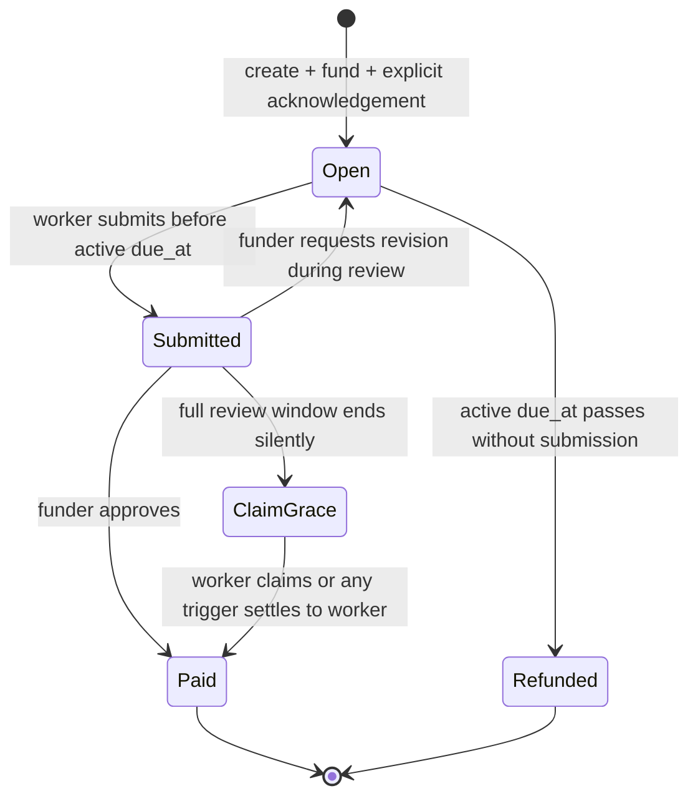

# PrazoPay protocol v1 candidate

Status: locally verified and deployed to Solana devnet at slot `479993358`

## Parties

- **Funder** locks the milestone amount and reviews delivery.
- **Worker** submits evidence and receives the released amount.
- **Trigger** may pay the transaction fee for an expired refund, but the
  program can return funds only to the immutable funder.
- **ZeroClaw** reads state and explains possible next actions. It is not a
  signer, adjudicator, or oracle.

## Agreement and version commitment

The milestone PDA is derived from:

```text
["milestone", funder_pubkey, task_id]
```

At creation, the account binds:

- funder and worker public keys;
- `task_id`;
- `terms_hash`;
- locked amount in lamports;
- active delivery deadline;
- review-window duration; and
- PDA bump.

The creation instruction also requires
`silence_acceptance_acknowledged = true`. A v1 flag is stored in the high bit
of the existing revision byte. Because the program can set that bit only after
the funder signs the explicit acknowledgement, the read-only plugin can
distinguish new v1 milestones from deployed legacy accounts without changing
the account length.

The plaintext terms must say that:

1. each valid submission starts the full review window;
2. silence after that window is acceptance;
3. no permissionless settlement may occur until the claim grace period ends;
4. a requested revision receives a fresh delivery window equal to the review
   duration.

Only the 32-byte terms commitment is stored. The program proves agreement to a
specific commitment and timing policy; it does not judge the plaintext or the
quality of work.

## State machine



`ClaimGrace` is a derived time phase of the stored `Submitted` state, not a
separate account enum. `Paid` and `Refunded` are terminal.

## Timing rules

- Review window: 60 seconds to 7 days, selected at creation.
- Claim grace: `min(review_window_secs, 1 hour)`.
- Revision delivery window: one review-window duration from the signed
  revision request.
- Maximum revisions: three.

This keeps the account layout unchanged while making all later deadlines
deterministic from signed state transitions.

## Transition rules

### Create

- amount must be greater than zero;
- initial deadline must be in the future and no more than 90 days away;
- review window must be between 60 seconds and 7 days;
- worker must differ from funder;
- `task_id` and `terms_hash` must be nonzero; and
- the funder must sign `silence_acceptance_acknowledged = true`.

Unlike v0, the review window does not have to fit before the delivery deadline:
review begins when a delivery is actually submitted.

### Submit

- signer must equal the immutable worker;
- status must be `Open`;
- chain time must be no later than the current `due_at`; and
- evidence hash must be nonzero.

Submission stores `submitted_at`. The complete review window ends at
`submitted_at + review_window_secs`.

### Request revision

- signer must equal the immutable funder;
- status must be `Submitted`;
- chain time must be before the review-window end;
- feedback hash must be nonzero; and
- fewer than three revisions must have been requested.

The transition returns to `Open`, increments the bounded revision count, and
sets the active deadline to `request_time + review_window_secs`. The original
deadline therefore cannot truncate review of a last-second submission.

### Approve

- signer must equal the immutable funder; and
- status must be `Submitted`.

The exact locked amount moves to the immutable worker. Approval remains
available during claim grace; grace is an operational buffer, not an extra
revision window.

### Settle after silence

- status must be `Submitted`; and
- chain time must be at or after:

```text
submitted_at + review_window_secs + claim_grace_secs
```

The legacy `claim_after_review` path remains available to the immutable worker.
For protocol v1, `settle_after_review` may instead be signed by any trigger.
The worker account is constrained by `has_one = worker`, so the trigger cannot
replace the recipient or redirect any lamports. The silence rule was explicitly
acknowledged in the creation transaction.

### Refund expired

- status must be `Open`; and
- chain time must be after the active `due_at`.

Anyone may trigger the instruction, but the exact locked amount can return only
to the immutable funder account supplied and checked by the program.

## Legacy compatibility

Accounts whose revision-byte high bit is clear remain `v0_legacy`:

- claim grace is zero;
- revision count is read from the unchanged low bits; and
- the old deadline constraint remains in the revision path.

The status plugin reports `protocol_version` and `acceptance_policy` so the
model cannot silently describe a legacy account using v1 guarantees.

## Safety invariants

1. `amount`, `funder`, `worker`, `terms_hash`, and review duration never change.
2. `due_at` changes only after a valid, funder-signed v1 revision request.
3. Only `Open` can accept a delivery.
4. A pending delivery blocks expiry refunds.
5. Only `Submitted` can settle to the worker, and permissionless settlement is
   available only for explicitly acknowledged v1 milestones.
6. Each milestone reaches at most one terminal state.
7. Settlement transfers exactly `amount`; rent remains in the audit account.
8. ZeroClaw output is advisory and cannot authorize a state transition.

## Explicit non-goals

- judging whether a deliverable is objectively good;
- resolving subjective disputes or providing an arbiter;
- proving that a Discord alert was seen;
- fiat or BRL conversion;
- mainnet deployment;
- arbitrary SPL-token custody in this version; and
- wallet-key storage or unattended agent signing.
