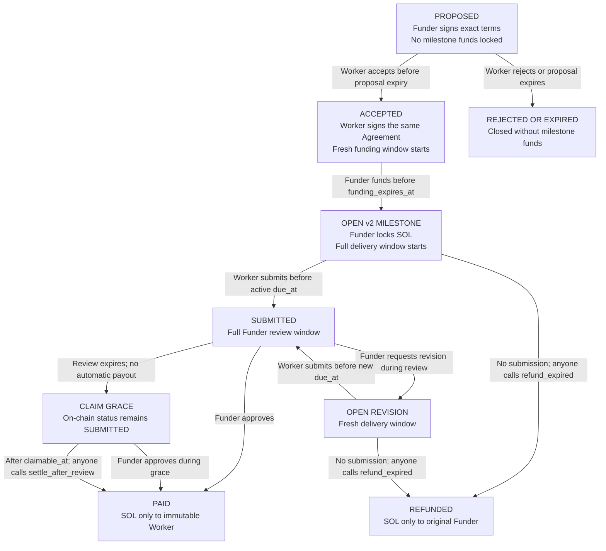

# PrazoPay protocol v2

Status: implemented, verified with a freshly built SBF in LiteSVM, and deployed
to Solana devnet at slot `480289270`. Historical v0/v1 accounts retain their
original timing rules.

## Why v2 exists

Protocol v1 made the Funder choose the Worker and lock SOL in one transaction.
That protected settlement but did not prove that the Worker had accepted the
price, terms, deadlines, or silence policy before funding.

Protocol v2 separates negotiation from escrow:

1. the Funder signs an unfunded on-chain proposal;
2. the named Worker signs acceptance or rejection of the exact commitment;
3. only an accepted Agreement inside its independent funding window can be funded; and
4. funding creates the Milestone and starts the full delivery window.

Discord may present and relay these facts, but neither a Discord message nor
an LLM response changes the protocol state.

## Parties

- **Funder** proposes terms, funds an accepted Agreement, and reviews delivery.
- **Worker** accepts or rejects the proposal and submits committed evidence.
- **Trigger** may pay a transaction fee for a permissionless terminal action,
  but cannot choose or replace the recipient.
- **ZeroClaw** reads finalized state, classifies the responsible role and next
  permitted action, and sends sparse notifications. It is never a signer,
  adjudicator, oracle, or custodian.

## Two linked accounts

The Agreement PDA is derived from:

```text
["agreement", funder_pubkey, task_id]
```

It binds:

- immutable Funder and Worker public keys;
- `task_id` and `terms_hash`;
- amount in lamports;
- delivery-, review-, and post-acceptance funding-window durations;
- proposal creation time for deterministic sparse monitoring;
- proposal expiry;
- explicit silence-acceptance acknowledgement;
- acceptance timestamp, funded Milestone PDA, and Agreement status.

The funded Milestone PDA remains:

```text
["milestone", funder_pubkey, task_id]
```

Funding copies the accepted values into the Milestone. The Milestone account
layout remains compatible with v0/v1; protocol version bits occupy the two high
bits of `revision_count`, while its six low bits hold the revision count.

## Lifecycle



`CLAIM GRACE` is a derived time phase of the stored `Submitted` state, not a
separate account enum. `Paid`, `Refunded`, and rejected Agreement outcomes are
terminal.

## Agreement transitions

### Propose

The Funder signs `propose_agreement`. The program requires:

- amount greater than zero;
- distinct Funder and Worker;
- nonzero `task_id` and `terms_hash`;
- delivery window from 60 seconds through 90 days;
- review window from 60 seconds through 7 days;
- proposal lifetime from 60 seconds through 7 days (the program derives the
  absolute expiry from the same transaction's Solana Clock);
- a post-acceptance funding window from 60 seconds through 7 days; and
- `silence_acceptance = true`.

Creating the Agreement pays only account rent. It does not create a Milestone
or transfer the milestone amount into escrow.

The program records `proposed_at` from the Solana Clock. The read-only
Agreement monitor uses that chain timestamp, not Discord message time, for its
state-entry, 30-minute, 2-hour, daily, and deadline notification stages.

### Accept or reject

Only the immutable Worker may call `accept_agreement` or `reject_agreement`,
and only while the Agreement is `Proposed` and unexpired.

Acceptance records chain time, derives
`funding_expires_at = accepted_at + funding_window_secs`, and changes the
status to `Accepted`. This is independent of the proposal deadline, so a valid
last-second acceptance still gives the Funder the complete committed funding
window. Rejection
changes it to `Rejected`; the proposal can no longer be funded. An expired
proposal is likewise not fundable. No escrow refund is needed because the
milestone amount was never locked.

### Fund

Only the immutable Funder may call `fund_accepted_agreement`. The Agreement
must still be `Accepted`, and chain time must be no later than
`funding_expires_at`.

In one atomic transaction the program:

1. changes the Agreement to `Funded` and records the exact Milestone PDA;
2. creates the corresponding protocol-v2 Milestone;
3. copies the accepted parties, amount, hashes, windows, and policy;
4. calculates `due_at = funded_at + delivery_window_secs`; and
5. transfers the exact milestone amount from the Funder to the Milestone.

If any check or transfer fails, all five effects roll back.

## Funded Milestone transitions

### Submit

- signer must be the immutable Worker;
- status must be `Open`;
- chain time must be no later than active `due_at`; and
- evidence hash must be nonzero.

Submission stores `submitted_at`. The full review window begins then, including
for a last-second delivery.

### Request revision

- signer must be the immutable Funder;
- status must be `Submitted`;
- chain time must be before the review-window end;
- feedback hash must be nonzero; and
- fewer than three revisions may have been requested.

The Milestone returns to `Open` and receives a fresh delivery window equal to
`review_window_secs`. Protocol v2 names this same committed duration
`revision_delivery_window_secs` in its canonical terms and requires both
values to be equal. Protocol version bits are preserved when the revision
counter increments.

### Approve

Only the immutable Funder may approve a `Submitted` Milestone. Approval moves
the exact amount to the immutable Worker. Approval remains possible during
claim grace until a terminal transaction wins.

### Settle after accepted silence

`settle_after_review` is available only at or after:

```text
submitted_at + review_window_secs + min(review_window_secs, 1 hour)
```

Any trigger may submit the transaction, but the recipient account is
constrained to the immutable Worker. The permissionless caller never receives
the escrow amount and cannot redirect it.

### Refund missed delivery

If a Milestone is `Open` after active `due_at`, anyone may trigger
`refund_expired`. The exact amount can return only to the immutable Funder.
A pending submitted delivery blocks this path.

## Communication commitments

Only cryptographic commitments are placed on chain:

- `terms_hash` commits the accepted human-readable agreement;
- `evidence_hash` commits the Worker's submitted artifact manifest; and
- `feedback_hash` commits revision feedback.

The program proves who signed which commitment and which transition became
valid. It does not prove that off-chain plaintext is truthful or judge work
quality. Canonical payload guidance and the role of Discord are documented in
[`COMMUNICATION.md`](COMMUNICATION.md).

## Compatibility

| Version | Creation path | Worker pre-funding signature | Silence settlement |
| --- | --- | --- | --- |
| v0 legacy | direct Milestone | no | immutable Worker claim |
| deployed v1 | direct Milestone plus Funder acknowledgement | no | permissionless trigger after review and grace |
| deployed v2 | Agreement, Worker acceptance, then funding | yes | permissionless trigger after accepted review and grace |

Existing Milestones remain readable and settle under their original rules.
The status plugin reports `protocol_version` and `acceptance_policy` so an LLM
cannot silently describe a legacy account using stronger v2 guarantees.

## Safety invariants

1. No Milestone amount is locked before Worker acceptance.
2. The Worker who accepts is the Worker who can submit and receive settlement.
3. Funding cannot alter the accepted parties, amount, commitments, or windows.
4. The delivery clock starts only when funding succeeds.
5. A pending delivery blocks expiry refund.
6. Every funded Milestone reaches at most one terminal state.
7. Terminal transfer is exactly `amount`; rent remains in the audit account.
8. Permissionless triggers select timing only, never destination.
9. ZeroClaw output is advisory and cannot authorize a transition.
10. A valid acceptance always opens the complete independent funding window.
11. Agreement monitoring follows the recorded Milestone PDA after funding;
    only a rejected/expired Agreement or terminal Milestone closes the journey.

## Explicit non-goals

- free-form on-chain chat;
- judging whether a deliverable is objectively good;
- resolving subjective disputes or providing an arbiter;
- proving that a Discord alert was seen;
- fiat or BRL conversion;
- mainnet deployment in this repository state;
- arbitrary SPL-token custody; and
- wallet-key storage or unattended agent signing.
